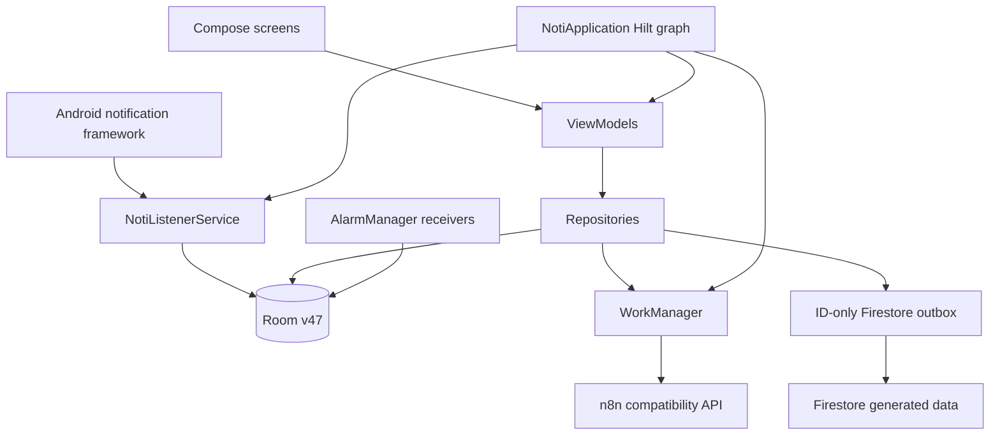

# Architecture and source guide

Noti is one Gradle module (`:app`) with a shallow, conventional package layout. `MainActivity` and
`NotiApplication` stay in the root package. The separate root and app Gradle files are normal:
the root declares shared plugin versions while `app/build.gradle.kts` configures the Android module.

## Runtime overview

Room is the device source of truth. Network success is never required to capture notifications or
perform a user action. Firestore retry operations contain IDs only; workers re-read generated data
from Room. Raw notification text is not represented in the Firestore proposal or item schemas.

## Package ownership

| Package | Responsibility | Important examples |
|---|---|---|
| root | Android process and activity entry points | `NotiApplication`, `MainActivity` |
| `ui` | Compose screens, reusable UI, presentation state | `AppScaffold`, `DrawerViewModel`, `ReviewScreen` |
| `domain` | Pure business rules without Android/Room/network APIs | notification filters/sorters, `domain.saveditem` merge and revert rules |
| `data.local.room` | Database, migrations, converters, and DAOs | `AppDatabase`, `AppDatabaseMigrations`, `FirestoreOutboxDao` |
| `data.repository` | Coordinates local state and side effects | notification repositories, `PendingOpRepository`, `DataDeletionRepository` |
| `data.remote` | Firebase, n8n, and Google Tasks adapters | `FirestoreSyncRepository`, `N8nAPIClient` |
| `di` | Hilt bindings with app-process lifetime | `AppModule` |
| `service` | Long-lived Android service boundaries | `NotiListenerService` |
| `receiver` | Alarm, boot, listener-rebind, and seen broadcasts | `NotiListenerRestartReceiver`, `ReminderAlarmReceiver` |
| `work` | Durable/deferred Android work | `ReminderPeriodicWorker`, `FirestoreOutboxWorker` |
| `model` | Room entities and stable application data | `NotiRecord`, `SavedItem`, `GeneratedProposal` |
| `util` | Small shared Android/Kotlin utilities | ongoing notification and time formatting |

The older `data.repository.reminder` and `ui.reminder` paths currently contain both saved-item and
scheduled-reminder code. Treat the class names as authoritative: `SavedItem*` means generated tasks
and keeps, while `ScheduledReminder*`/`ReminderScheduler` means Android reminder notifications.
New pure saved-item rules belong in `domain.saveditem`; new code should not reintroduce the ambiguous
`domain.reminder` package.

## Significant file roles

- `NotiApplication.kt`: creates the Hilt process graph, configures Hilt WorkManager construction,
  installs Firebase App Check, disables debug Crashlytics collection, and wakes the Firestore outbox.
- `MainActivity.kt`: hosts Compose, sign-in, notification-listener access, and background-work bootstrap.
- `NotiListenerService.kt`: framework callback adapter; filters, stores, caches source intents, posts
  ongoing status, preserves delayed cancellation, and requests recovery after disconnect/destruction.
- `AppDatabase.kt`: v47 Room contract. Every version change requires an exported JSON schema and migration.
- `AppDatabaseMigrations.kt`: explicit migration chain; never use destructive fallback for production.
- `PendingOpRepository.kt`: stages generated operations, computes review groups, and applies/undoes/rejects
  multi-table changes transactionally. It permanently records proposal decision state.
- `SavedItemRepository.kt`: task/keep mutations and Firestore convergence scheduling.
- `FirestoreOutboxWorker.kt`: replays payload-free operations for the current Firebase UID only.
- `DataDeletionRepository.kt`: separate local raw-history deletion and cloud/generated-data deletion.
- `N8nAPIWorker.kt`: typed WorkManager dispatch boundary for temporary n8n endpoints.
- `OngoingNotiUtils.kt`: localized recent-window count plus task/keep awaiting-review counts.

## Dependency direction

UI calls ViewModels; ViewModels call repositories; repositories use DAOs and remote adapters; pure
domain functions depend only on plain models. Android framework callbacks delegate inward rather
than placing business rules in services or receivers. Some older ViewModels/repositories still use
manual construction; new or touched entry points should use constructor injection.

See [HILT.md](HILT.md) for object lifetimes and generated-code behavior.
