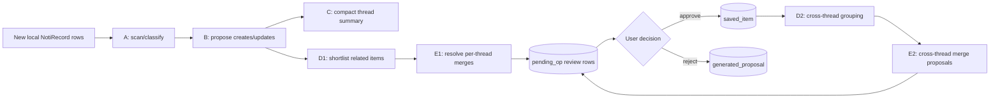

# Staged extraction and review pipeline

This document describes the current per-notification-key v3 pipeline. The exported n8n workflows are
temporary compatibility references; Android owns endpoint constants, input construction, validation,
Room staging, and user decisions.

## Stages

- **A — scan:** classifies the thread and decides whether extraction work is justified.
- **B — items:** returns generated create/update instructions backed by source record IDs.
- **C — summary:** advances the thread fold watermark and keeps future context bounded.
- **D1/E1 — local merge:** finds related existing saved items and proposes conservative merges.
- **D2/E2 — reflection:** periodically considers relationships across notification keys.

## Item and merge semantics

Automatic extraction is precision-first. A **Task** is unresolved work that must survive beyond
reading, acknowledging, or immediately replying to the notification. A **Keep** is information with
a credible future retrieval occasion after the source notification is gone. If reading or a simple
reply exhausts the notification's value, the normal result is no item. A forced/manual extraction is
an explicit one-run override and may return multiple independent Tasks and Keeps, but every result
still needs record evidence.

One Task is one completion and scheduling unit. Subtasks are reserved for steps the user could handle
in the same session under one parent deadline. Different deadlines, waiting periods, locations, tools,
or handling sessions require separate Tasks even when they share a person, topic, or event. `whenAtMs`
is always user-owned: workflows may read it to avoid an unsafe merge, but no workflow may create or
change it. Evidence-backed deadlines remain model-managed.

Merges are limited to exact duplicate/update units or genuine same-session action bundles. Keeps merge
only when their information will be retrieved and become obsolete together. Task/Keep cross-type
merges and merges with conflicting user-set When values are also rejected by Android before staging.

`N8nWorkerInput` is the typed WorkManager boundary. `N8nWorkerHandlers` exhaustively dispatches each
supported job to a focused handler. Invalid/unknown input stops before side effects.

## Evidence and review invariants

An extraction proposal citing no record ID that Android actually sent is dropped before Room staging.
The pipeline never writes directly to `saved_item`: complete instructions enter `pending_op`, and the
review UI groups them into one eventual task/keep decision. Approval, rejection, and undo execute their
local multi-DAO changes in a Room transaction.

Every generated instruction is also copied to `generated_proposal` with a durable decision:
`pending`, `approved`, `rejected`, or `superseded`. That generated payload may synchronize to Firestore.
It must not contain copied raw notification snapshots; provenance is record IDs only.

Buttons are parent-owned `{buttonText,intent,type}` actions. Creates use `buttons`; updates and merges
append through `changes.addedButtons`. Copy actions are reserved for values likely to be pasted or
entered later. Link labels use grounded source text when present, otherwise Android derives a readable
host/short-path label and hides opaque token paths.

## Journal and idempotency

`extraction_journal_entry` and `extraction_journal_summary` record prior pipeline/user outcomes per
notification key. `lastFoldedPostTime` is the processing watermark. The periodic worker re-drives active
keys with records newer than that watermark, so missed foreground scheduling can recover without treating
every historical record as new.

User edits, completion, archive, deletion, rejection, and revert events feed the journal so later model
runs do not blindly recreate work the user already handled. Merge-rejection pairs enter a cooldown table
to avoid immediately proposing the same rejected combination.

## Remote contract and authentication

Endpoint paths live in `app/build.gradle.kts`; do not rename or test them with real notification content.
OkHttp attaches a Firebase ID token and App Check token when available, but the temporary n8n server does
not enforce them. The future GCP service must verify both tokens and derive account identity rather than
trusting request `userId`.

Logs may include stage names, IDs, counts, status codes, and byte counts—never request/response bodies.
