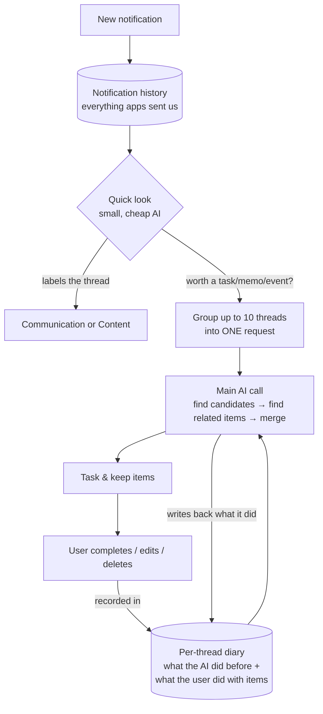
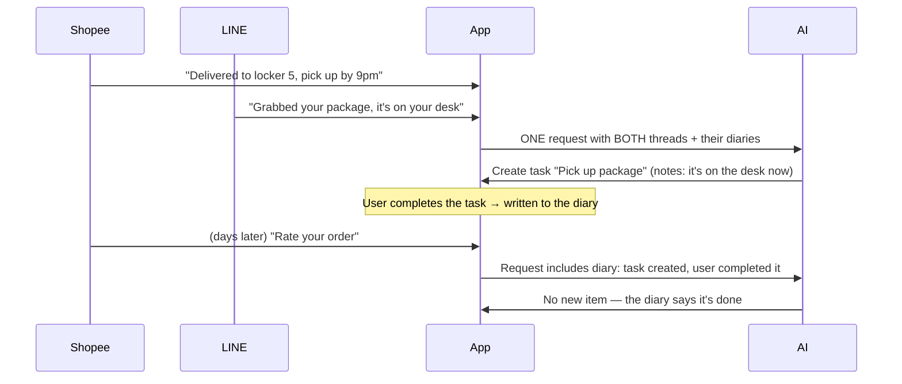
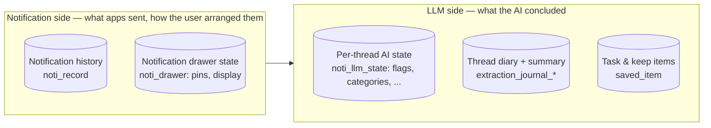

# How the app turns notifications into tasks

This doc explains the task/keep-item extraction pipeline in plain language — read it before
touching anything under `data/remote/n8n/` or the reminder repositories. For the notification
capture flow that feeds this pipeline, see [notification-pipeline.md](notification-pipeline.md).

The app watches incoming notifications and tries to turn the useful ones into **task/keep items**
("pick up the package by 9pm"). The hard part isn't extracting once — it's *not extracting twice*,
and knowing when new notifications should update an existing item instead of creating a new one.

## The pipeline

- A **small, cheap AI** (the "scan"/classification stage) takes the first look at each
  notification thread: is there anything task-like here, and is this thread a *conversation with
  the user* (messages, personal email) or just *content* (news, promos)?
- Threads that pass are **grouped together into one request** to the main AI, which finds task
  candidates, looks up related existing items, and merges — updating an existing item rather than
  creating a duplicate.
- Merging is deliberately **conservative**: information from two different threads is only
  combined when there's a concrete link (same order number, same named event, an explicit
  mention). Similar timing or topic is never enough — a missed merge is easy to fix later, a wrong
  merge corrupts a card the user has already seen. Every merge states its justification, visible
  in the item's change history.

## The diary idea

For every notification thread, the app keeps a small **diary** (the *extraction journal*): "sent 3
notifications to the AI", "created task X", "user completed task X", "decided not to extract,
because…". When the diary gets long, the AI condenses the old part into a one-paragraph summary.
Every future request for that thread includes the diary — so the AI remembers what already
happened without re-reading everything.

That's how the app avoids re-creating a task the user already finished:

Diary entries carry an `origin` tag: `user` (a real user action — ground truth), `llm` (something
the AI concluded), or `system` (bookkeeping). User actions always outweigh AI conclusions.

## Why we didn't switch to the "chat replay" design

An alternative we evaluated: keep an ongoing AI conversation *per notification thread*, and resend
the whole conversation every time a new notification arrives, relying on the AI provider's
discount for repeated text (prompt caching).

Three problems:

1. **The discount expires in minutes.** Notifications in one thread arrive hours or days apart, so
   almost every replay would pay full price anyway.
2. **The expensive part is never discounted.** Most of the bill is the AI's internal reasoning and
   its answer, not the resent text. One conversation per thread means paying that up to 10× more
   often than one grouped call.
3. **Threads can't see each other.** In the example above, the LINE message alone is just chat —
   it only matters *because* the Shopee task exists. Separate per-thread conversations would never
   connect them; grouping threads into one call does.

What we **kept** from the idea: the diary (its summary step), recording *why the AI chose not to
extract* (the `no_extraction` diary entry, so it stays consistent next time), and ordering our
requests so the stable text comes first — which earns the provider discount where it genuinely
applies.

## How the data is organized

Rule of thumb for anyone touching this code: **the notification side describes what happened; the
LLM side is what the AI made of it.** Anything new the AI concludes about a thread (categories,
gate flags, scores, summaries) goes into `noti_llm_state` — never onto NotiUnit or the
notification tables. What the user does to AI-made items (complete, edit, delete) is written into
the thread's diary, because it's part of that story.

## Housekeeping

- **Idle threads**: when a thread has diary entries but no new notifications for
  `journalIdleFoldDays` (default 7), its diary is condensed into the summary by piggybacking on
  the next extraction request. Threads that never produced an item are just truncated locally — no
  AI call needed.
- **Re-classification**: a thread's category almost never changes, so the classifier re-runs only
  when the thread's record count has doubled since it was last classified, or 14 days have passed.
